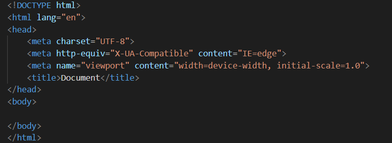

# HTML总结

* 这是一个新建的HTML文档  
    
(1) `<!DOCTYPE html>`:声明文档类型。  
(2) `<html></html>`:`<html>`元素。这个元素包裹了整个完整的页面，是一个根元素，其它元素都嵌套到其中。  
(3) `<head></head>`: `<head>`元素。 这个元素是一个容器，它包含了所有你想包含在HTML页面中但不想在HTML页面中显示的内容。这些内容包括你想在搜索结果中出现的关键字和页面描述，CSS样式，字符集声明等等。  
